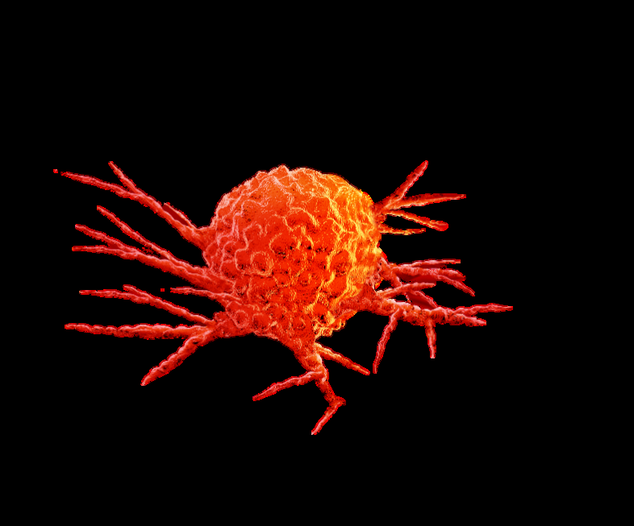
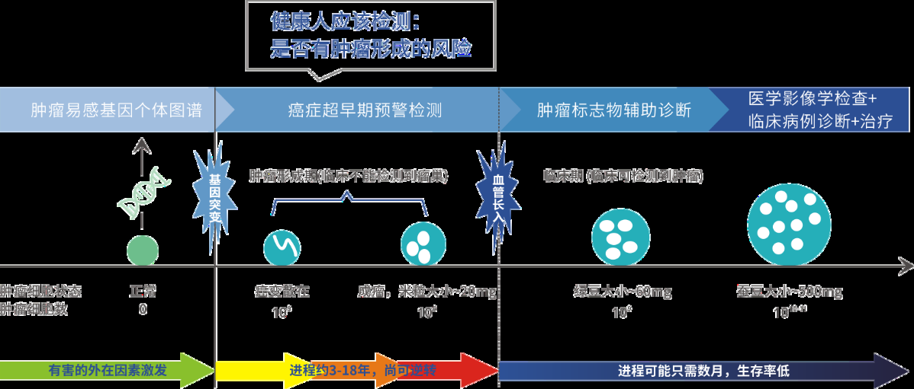
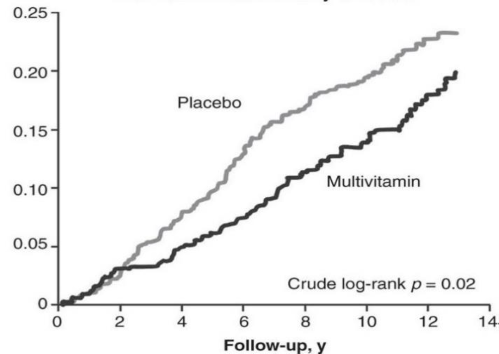
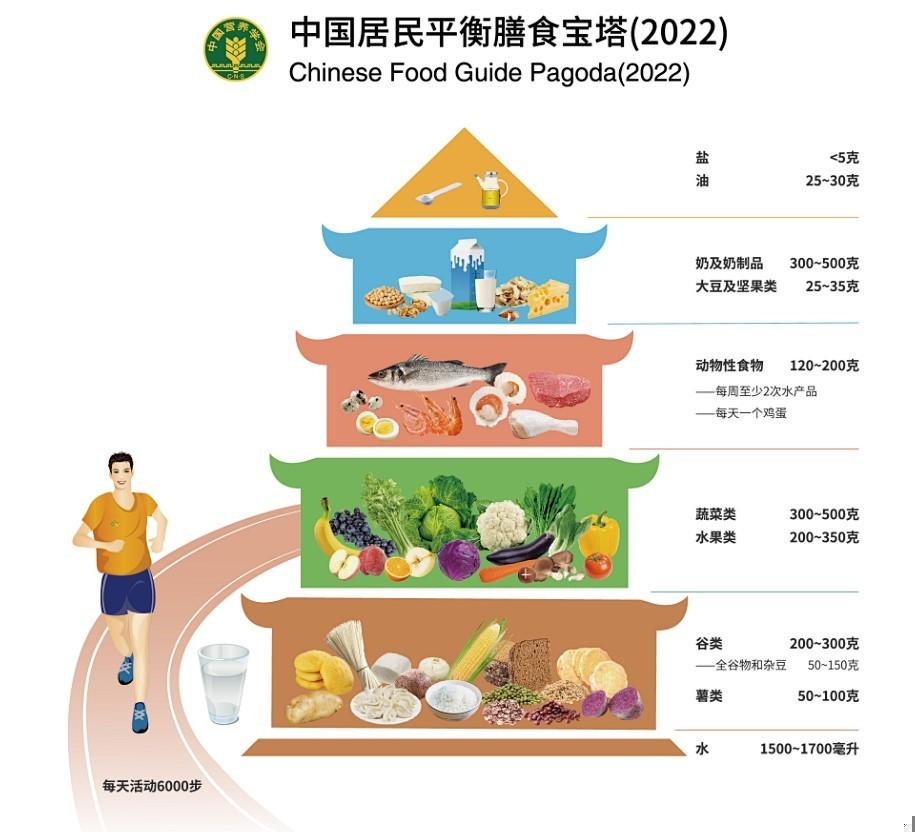

# 第六部分 健康生活指南

## 6-1 控制癌症风险

"癌症"的英文名字cancer起源于拉丁文，直译是"螃蟹"。早在公元前400年，医学鼻祖希腊医生希波克拉底（Hippocrates）首先用这个词在他的病历中对器官组织的癌症做过记录。之所以使用这个词，是因为他观察到癌症就像螃蟹一样在身体里四处横行，疯狂地横扫并扩展它的地盘，直至将宿主组织吞噬消灭，人就死亡了。到了19世纪，德国生理学家穆勒博士在显微镜下发现，癌症是由大量的癌细胞聚集起来形成的。他发现癌细胞与正常细胞大不相同，具有超强的分裂能力，非常"饥饿"地攫取组织中的营养而能快速地生长。

癌症不是一朝一夕就形成的，我们的检测就是要在它无声无息的生成时，抓住它！

人体细胞由正常变成异常的癌细胞，再聚集成实体肿瘤，继而再变成恶性癌肿，可分为癌变潜伏期和癌症期两个时期，经历了两个细胞质变和量变的过程。癌变潜伏期适于第一个质变，就是细胞基因突变，导致细胞分裂变成癌细胞，游离分散存在于器官组织之中。这些癌细胞一旦逃过免疫系统的剿杀，才会越聚越多，形成实体瘤。瘤体内分泌的一些细胞因子会吸引新生的毛细血管长入瘤体，造成了第二个质变过程，即大量的血管长入瘤体，使得癌细胞获得丰富的营养，造成细胞分裂的速度呈几何级数疯长。同时癌细胞可以脱落入血向身体其他部位转移，造成对其他器官的占位和功能损害，致人于死地。癌细胞无限增殖和癌细胞转移，才是癌症名副其实的两大特征。

---

### 1、癌症风险通过科学的健康管理是可以控制并消除的

越来越多的科学证据清晰地表明癌症的风险是可以控制并被消除的，不是只靠医学上的突破或神奇药物，而可以依靠科学的健康管理和生活方式的改变。美国国家卫生院（NIH）下属的国立癌症研究所（NCI）联合美国癌症研究所（AICR）自1983年以来，一直致力于癌症预防的项目，在饮食、营养和防癌领域做了大量的开拓性工作。至今已有超过4500项的研究是饮食和防癌项目的组成部分。该项目集合了100多名科学家和癌症研究专家十数年的研究成果，发表了研究报告《食物、营养和防癌：全球化的视角》，还发表了《防癌抗癌营养和运动指南》。这两份文件给出的众多可信的、科学的防癌措施，本报告选取了这个研究报告中相关建议和指导，明确地告诉您，我们每个人现在都可以采取行动，增强身体天然的抵抗能力，与身体中各类潜在的"致癌风险"展开较量。

### 2、癌症风险对策的一般原则

（1）**保持愉悦的心态**：查出癌症风险，不论结果报告是什么级别，都不是临床诊断的癌症，所以不要紧张，最忌讳惊恐、害怕和焦虑。长期不良情绪会使人体产生应激反应，过强的应激反应就会降低人体免疫力，使癌细胞有可乘之机。

（2）**保持癌细胞-免疫力的平衡**：正常人体内每天都有细胞分裂生成的癌细胞分散存在于器官组织之中。癌细胞不断地生成，又不断地被自身的免疫系统消灭，这种动态平衡保持了人的健康。有了风险说明癌细胞的生成比自身免疫力占了优势，所以控制风险最重要的对策是增强自身免疫力。

2015年，美国癌症研究学会(AACR)年报总结出生活中最常见的免疫力五大杀手，世人应该注意矫正：

- a) 运动不足或不正确
- b) 营养不足或不正确
- c) 抑郁、精神压力大的不良情绪
- d) 吸烟、滥用药物、长期熬夜
- e) 缺乏和谐而充满爱的家庭生活

### 3、运动健身，能防癌吗？

能！运动的确是防癌"神器"。因为癌症是一种"能量"疾病，能量在癌细胞激活过程中扮演着重要的角色，同时能量又是维护正常细胞生命周期所必须。健康的关键就是维持能量的平衡。能量来源于糖、脂肪和蛋白质，我们用卡路里作为计算单位。超重、肥胖以及过多的能量供应都会促使细胞发生癌变。因为运动会燃烧更多的卡路里，不但能瘦身减肥，还能改变情绪状态，运动常常是治疗忧郁的最佳方式。跑步是一件令人感到非常愉悦的事情。跑步给我们带来的那种幸福、自由和能量充沛的感觉不仅仅是内啡肽的作用，还受到一种重要的神经递质--多巴胺的影响，引起耐力运动的"奖赏效应"。有研究证明，那些进行适量体育运动的人群来说，患某些癌症如乳腺癌、结肠癌、子宫内膜癌和晚期前列腺癌的风险会更低。不管体育运动是否影响了体重，运动本身都降低某些癌症的患癌风险。

**建议**：

- 日常保持在热量摄入和运动之间维持平衡
- 成年人要在日常活动的基础上每周至少5天每天至少30分钟参加中强度的有氧运动（要出汗，但切忌大汗淋漓，切忌呼哧带喘）

### 4、服用营养保健品、复合维生素有助于防癌吗？

有！但要坚持长期适量服用。2015年美国癌症研究学会（ACCR）发布了癌症预防的最新研究成果（14,641受试者），长期服用复合维生素及矿物质可以降低23%的癌症发生率。

许多维生素都是抗氧化剂，对保护自身组织免受自由基（氧化）所导致的持续性损害。由于这种损害可增加癌症风险，所以某些抗氧化剂可能会有助于预防癌症。例如维生素C、维生素E、类胡萝卜素（比如β-胡萝卜素和维生素A）和其他植物化学物质。研究显示，多食用富含维生素和抗氧化剂物质的蔬菜和水果会降低人们患某些癌症的风险。

**叶酸**：是一种天然的B族维生素，很多蔬菜、豆类、水果、全谷类和强化早餐谷类食品中都含有叶酸。20世纪90年代开展的研究表明，缺乏叶酸可能会增加人们患结直肠癌和乳腺癌的风险，对饮酒人群来说尤其如此。然而，自1998年以来，美国的强化谷物制品中都添加了人工叶酸，所以大多数人都能从饮食中摄入足够叶酸。

**硒**：在多种矿物质中，硒对人体的抗氧化防御机制有帮助。一项临床研究表明硒补充剂可能会降低人们患肺癌、结肠癌和前列腺癌的风险。但是，人们还应避免服用高剂量硒补充剂，因为硒补充剂的安全剂量和中毒剂量之间相差极少。服用硒补充剂的最高剂量不应超过200微克每天。

**钙**：高钙食物可能有助于降低结直肠癌风险，钙补充剂也能适当地减少结直肠息肉的复发。但是，摄入过多的钙（钙补充剂来源或食物来源）可增加人们患前列腺癌的风险。因此，男性应主要通过食物来摄入推荐剂量而非过量的钙质。女性易患骨质疏松，所以也应通过食物来获取推荐剂量的钙。钙的推荐摄入量是19-50岁人群每天1000毫克，50岁以上人群每天1200毫克。乳制品和某些绿叶蔬菜是钙的优质来源。主要通过乳制品获取钙的人群应该选用低脂或脱脂乳制品，以减少对饱和脂肪的摄入量。

### 5、Science重大发现：1天1包烟有多可怕？每年150个基因突变！

来自英国Wellcome Trust Sanger研究所、美国Los Alamos国家实验室等机构的科学家们发现，每天吸一包烟的"吸烟者"每年每个肺细胞中会累积平均150个额外突变。2016年11月4日发表在Science杂志上的这一研究提供了吸烟数量与肿瘤DNA中突变数量之间的直接关联。其中，肺癌中观察到的突变率最高，但身体其它部分的肿瘤中也包含了这些吸烟相关的突变。

**警惕无形杀手"二手烟"**：除了主动吸烟者，世界上还有很多受二手烟危害的人。研究指出，中国有近7.4亿人每天暴露于二手烟雾危害之下，其中1.82亿为儿童。2016年7月8日发表在PLOS ONE上的研究指出，烟草烟雾对DNA完整性具有双重影响：它不仅破坏DNA，还抑制了DNA损伤修复的一个关键过程，就是说烟草烟雾是促进肺癌发展的一个新途径。

### 6、饮酒会增加患癌风险吗？

会！饮酒会增加人们患口腔癌、咽癌、喉癌、食管癌、肝癌、乳腺癌、结肠癌和直肠癌的风险。饮酒人士应该限制酒的摄入量，男士每天饮酒不宜超过2酒精单位，女士不超过1酒精单位。1酒精单位相当于360ml啤酒、150ml的葡萄酒、或者45ml 40度烈性酒。对某些癌症而言，同时饮酒并吸烟所增加的患癌风险远高于只饮酒或只吸烟的风险。规律的饮酒，即便每周的饮酒量很少，也可增加女性患乳腺癌的风险。乳腺癌高危女性群体可以考虑戒酒。

### 7、膳食纤维能降低癌症风险吗？

能！膳食纤维是指多种人体不能消化的植物性碳水化合物。干燥豆类、蔬菜、全谷类和水是膳食纤维的优质来源。膳食纤维可进一步分为"可溶的"（比如燕麦麸、豌豆、豆类和洋车前子纤维），和"不可溶的"（比如小麦麸、水果皮、坚果、种子和纤维素）。最新研究表明，膳食纤维可降低某些癌症的风险，尤其是结直肠癌。因此，ACS建议人们食用全谷类、蔬菜和水等高纤维食物来帮助降低癌症风险。

### 8、大豆制品能降低癌症风险吗？

和其他豆科植物一样，大豆及大豆制品是蛋白质的优质来源以及肉类的有益替代品。大豆含有多种植物化学物质，其中包括异黄酮。大豆中的植物化学物质具有微弱的雌激素样活性，并可能有助于预防激素依赖性癌症。有越来越多的证据表明食用传统大豆制品比如豆腐可能会降低人们患乳腺癌、前列腺癌或子宫内膜癌的风险。也有一些证据表明食用传统大豆制品可能还会降低人们患某些其他癌症的风险。

### 9、大蒜能降低癌症风险吗？

大蒜和其他葱属植物中含有的葱属植物化合物对健康有益的说法广为流传。针对大蒜能否降低癌症风险的研究正在进行，一些研究表明大蒜可以降低结直肠癌的风险。大蒜和其他葱属植物可以被列到能够降低癌症风险的推荐蔬菜目录当中。目前尚没有充足证据证明葱属植物化合物补充剂能降低癌症风险。

### 10、肥胖会增加癌症风险吗？

会。超重或肥胖与人们更高的乳腺癌（绝经后女性）、结直肠癌、子宫内膜癌、食道癌、肾癌、胰腺癌、胆囊癌（可能）患癌风险有关。肥胖也可能与人们更高的肝癌、宫颈癌、卵巢癌以及非霍奇金淋巴瘤、多发性骨髓瘤和侵袭性前列腺癌的患癌风险有关。

虽然对减肥是否会降低癌症风险的研究有限，但是一些研究表明，减肥会降低绝经后女性患乳腺癌和其他癌症的风险。成年人避免过度的体重增加也是十分重要的，因为这不仅可能会降低患癌风险，还可能会降低他们患其他慢性疾病的风险。

### 11、喝茶（红茶或绿茶）能降低癌症风险吗？

茶是一种饮料，茶树的叶子、嫩芽或细枝均可泡制成茶。红茶、绿茶、白茶、普洱茶和其他各种类型的茶均来自于同一棵茶树，但是它们反映了不同的加工方式。一些研究人员提出，茶之所以会预防癌症是因为茶含有抗氧化剂、多元酚和类黄酮。动物研究已证明有些茶（包括绿茶）可降低癌症风险，但是人类研究发现的结果喜忧参半。虽然实验室研究结果一直令人满意，而且喝茶也是许多美食的一部分，但是目前的证据尚不能证明喝茶是降低癌症风险的主要原因。

### 12、多吃抗癌食物就能防癌？

肿瘤与饮食有着千丝万缕的关系，健康饮食更是对抗癌症的有效措施之一。"吃什么能防癌？"家庭医生在线肿瘤频道的咨询帖中不少网友都有此疑问。国外有很多探索食物中"抗癌物质"的实验，发现了不少具有"抗癌物质"的"抗癌食物"，如包菜等十字花科植物、番茄等等。但肿瘤的发生是多种因素综合作用的结果，饮食仅是其中一个方面；另外，食物进入人体还有一个非常复杂的代谢过程，受多种因素影响，这些"抗癌食物"或许对身体有一定的好处，但具体有何效用、效用大小却并未可知。为此，寄望于多吃某些食物能预防癌症的想法是不科学的。

---

## 6-2 预防心脑血管疾病风险

### 1、食品宜与忌

① **食物多样、搭配合理**：碳水化合物50-60%；蛋白质10-15%；脂肪20-30%，平均每天需要12种以上，每周需要25种以上食物。

② **吃动平衡、健康体重**：每周至少5天中等强度运动，累积150分钟，每天走6000步以上；减少久坐时间。

③ **多吃蔬果、奶类、全谷物和大豆**：强调摄入全谷物，减少精细谷类，常吃大豆制品和坚果，每天摄入300g新鲜蔬菜，其中深色蔬菜占1/2，每天摄入200-350g新鲜水果。

④ **适量吃鱼、禽、蛋、瘦肉**：每天平均3-4两鱼禽肉蛋类、每周吃2次鱼，每天一个鸡蛋（不弃蛋黄），少吃肥肉、烟熏肉和腌制肉。

⑤ **少油少盐，控糖限酒**：每日盐摄入量小于5g，每日酒精摄入量小于15g。

⑥ **规律进餐，足量饮水**：每日饮水量1500-1700ml，主动饮水，少量多次，推荐白水和茶水；少喝、不喝含糖饮料。

⑦ **会烹、会选、会看标签**：选择新鲜、营养密度高的食物，合理选择预包装食品。

### 中国居民平衡膳食宝塔(2022)

**第一层：谷类200~300克**，其中包括全谷物和杂豆50~150克；薯类50~100克。

膳食宝塔一共有6层：最下面是水1500-1700ml。除此之外，要求每天行走6000步。

建议平均每天摄入12种以上的食物，每周25种以上，按膳食宝塔的原则合理搭配。

《黄帝内经》记载："五谷为养，五果为助，五畜为益，五菜为充"，充分体现谷类食物的重要性。从营养学角度来说，谷类是膳食的主体，人体所需能量主要由谷类食物提供。研究显示：碳水化合物供能比在50%～55%的是一个比较平衡的量，如果低于40%或者高于70%都会增加死亡率，呈U型关系。

除了谷类以外，新指南特别提出每天摄入50～100g薯类。薯类食物常见的就是红薯、土豆、芋头、山药，既可以当主食吃，补充热量，也可以补充精白面粉里缺乏的维生素C、B族维生素、钾、胡萝卜素、膳食纤维等，避免营养学上的"隐性饥饿"。

**第二层：蔬菜类300~500克，水果类200~350克**。

蔬菜水果的水含量为65～95%，因此热量低；也是膳食纤维、维生素的主要来源，预防慢性病。建议每餐安排至少2种，也应占整体膳食餐盘的1/2，且合理搭配：

- **多种蔬菜均衡搭配**：每天至少达到3~5种。叶菜、十字花科蔬菜如油菜、绿菜花（西兰花）、各种甘蓝等，富含膳食纤维和异硫氰酸盐等有益物质；瓜茄类蔬菜维生素C和类胡萝卜素含量较高；鲜豆类含有丰富的氨基酸、多种矿物质和维生素。菌藻类食物的维生素B、铁、硒、钾等的含量都很高；海带、紫菜富含碘。每种蔬菜特点都不一样，所以应该不断更换品种。

- **深色浅色搭配，深色应占蔬菜总量1/2**：根据颜色深浅，蔬菜可分为深色蔬菜和浅色蔬菜，蔬果颜色是水果和蔬菜营养素、植物化学物丰富的表现。紫、红、黄（橙）、深绿色的都是深色蔬菜，富含β-胡萝卜素，是膳食维生素A的主要来源。浅色蔬菜中多糖和硫化物含量较高，有助于稳定血糖血压、降低胆固醇；而且饱腹感好，降低膳食的总热量，可帮助控制体重。

而水果，每天至少吃1~2种，首选应季水果。

**第三层：动物性食物120~200克，每周至少2次水产品，每天一个鸡蛋**。

鱼、禽、蛋类和瘦肉可提供人体所需要的优质蛋白质和多种微量元素，但含有较多的饱和脂肪酸和胆固醇，不宜过多摄入。

鱼和禽类的脂肪含量相对较低，且水产品还含较多的不饱和脂肪酸，有些鱼类富含EPA和DHA，对预防血脂异常和心脑血管疾病等有一定作用。

蛋黄是蛋类维生素和矿物质的主要集中部位，且富含磷脂和胆碱，对健康十分有益。对健康人群来说，每天吃一个鸡蛋的营养效益远高于其胆固醇的影响，因此吃鸡蛋不要丢弃蛋黄。当然，对于血脂异常或者有心脑血管疾病的人群，胆固醇还是要限量摄入的。

**第四层：奶及奶制品300~500克，大豆及坚果类25~35克**。

牛奶中蛋白质含量平均为3%，必需氨基酸比例符合人体需要，属于优质蛋白质，并且是维生素B2、钙的良好来源。奶制品不仅包括液态牛奶，还有酸奶、奶酪等。

大豆含有丰富的蛋白质，尤其含谷类缺乏的赖氨酸；大豆中脂肪主要是不饱和脂肪酸，约占85%，必需脂肪酸——亚油酸含量高达50%；碳水化合物近半是膳食纤维。钙、钾和维生素E含量丰富。

坚果中脂肪含量达40%以上，为高能量食物，但坚果为优质脂肪，其中以单不饱和脂肪酸为主，是亚油酸、α-亚麻酸、烟酸的良好来源，同时也是钾、钙、锌等矿物质、以及维生素E和B族维生素的良好膳食来源。每周吃适量的坚果有利于心脏健康，推荐平均每周50~70g（平均每天10g左右）。

**第五层：盐＜5克，油25~30克**。

食盐、烹调油摄入过多会增加高血压、脑卒中、肥胖等疾病的发生风险。

**控盐小技巧**：

- 少吃加工食品，学会看营养标签，拒绝高盐食品
- 使用限盐勺，日常逐渐地减少盐的使用
- 用一些天然的食材和调料来增加味道，丰富口感。比如西红柿、蘑菇、洋葱、辣椒、大蒜、大葱等
- 选择低钠盐、减盐的酱油等调味料

食用油宜多样化，首选植物油，如富含单不饱和脂肪酸的橄榄油、茶油、菜籽油，富含DHA、EPA、α-亚麻酸的鱼油、亚麻籽油，富含多不饱和脂肪酸的玉米油、葵花籽油、大豆油、花生油。而高饱和脂肪酸的黄油、牛油、猪油要控制在总脂肪摄入量的10%以下。

**总结**：

1. 主食：粗细搭配，比例合适
2. 蔬果：蔬菜注意一半是绿叶菜，水果要少于蔬菜
3. 优质蛋白：四大类——瘦肉、蛋、奶、大豆（黄豆、黑豆、青豆）

每个人基于自己的性别、年龄、身高、体重、基础代谢、活动量、人体成分、喜好等因素，选择最适宜自己的"质"与"量"。最好是在专业人员的指导下制定方案。

### 2、体育锻炼宜与忌

参加力所能及的体育锻炼和体力活动，可帮助改善血液循环,改善脂质代谢，增强体质和防止肥胖。运动可使高三酰甘油血症患者的血脂含量完全降至正常水平。不仅如此，运动还能提高人体血液中一种对抗动脉粥样硬化的脂蛋白——高密度脂蛋白(HDL)的含量，改善心脏功能，增加心脏的侧支循环，从而也起到防治冠心病的良好作用。

### 1）适宜的体育锻炼

- **步行**：是最佳的有氧代谢运动，每天宜步行30分钟左右
- **太极拳**：对于动脉粥样硬化有较好的防治作用。体力较好的患者可练老式太极拳，体力较差者可练简化式太极拳
- **慢跑**：慢跑或原地跑步亦可。至于慢跑的路程及原地跑步的时间应根据每个人的具体情况而定，不必强求
- **其他形式的运动**：如游泳、骑自行车、体操、打球、爬楼梯等，均很适合，但须量力而行，且要持之以恒

### 2）应忌的体育锻炼

- **不宜做剧烈活动**：如快跑、快节奏的舞蹈等。如果出现"呼哧带喘"的情况，说明已有心脑组织缺氧，陡然增加心梗或脑梗的风险，一定要避免
- **不宜清晨锻炼**：上午6时至9时是冠心病和脑出血发作最危险的时刻，发病率要比上午11时高出3倍多。人体在上午时段交感神经活性较高，随之而来生物电不稳定性增加，易导致心律失常，可能出现室颤，引起猝死。还有，人的动脉脉压在上午较高，增加了动脉粥样硬化斑块破裂的可能性，导致急性冠脉综合征的发作。所以在进行体育锻炼时，要避开心血管事件"高峰期"，将时间安排在下午及傍晚进行

### 3、生活习惯宜与忌

### 1）适宜的习惯

- **劳逸结合**：学会积极工作，合理的休息，保证充足睡眠
- **生活规律**：遵守良好的作息制度，养成健康的生活习惯
- **健康心理**：心胸开阔，心情愉快，努力使心态保持平衡，兴趣广泛，生活有规律

### 2）应忌的习惯

- **戒酒**：尤其是烈性酒，酒精除供给较高的热量外，还使三酰甘油在体内合成增加
- **避免精神紧张、情绪激动和过度劳累，减少烦恼焦虑**

### 4、老年人预防心梗和脑梗须知

年纪大了床头放三样东西，必要时可救命：**1瓶水，2颗阿司匹林和急救电话**

能马上要人命的病主要有两种：一是心肌梗塞，二是脑梗。这两种病通常是在半夜时发作，睡眠中惊醒、胸闷或头痛，恶心和大量的发冷汗。此时要立刻口含两颗阿司匹林（每颗剂量为300毫克），嚼碎，喝一点水吞下。接着立刻电话联络急救中心120，越快越好！然后坐在床上或者椅子或者沙发上，静候救护车援助，千万别躺下！！

**夜间睡前喝250ml温热白开水**

据统计，心梗患者绝大部分是清晨起床时被发现的，猝发时间多在半夜。人在夜间因呼吸和出汗会耗散部分水份，夜间缺水会使血液黏稠度升高，血小板凝聚力亢进，使原来粥样硬化的血管更易产生栓塞，老年人在夜间喝一杯白开水，有助于预防中风和心梗的发生。

**每天喝绿茶**

北京大学医学院附属医院内科主任等专家主张每日喝绿茶。有研究发现与那些从不喝绿茶的人相比，每天喝绿茶一杯以上的人发生心梗的可能性减少42%。

首先，绿茶里含有氟可以杀菌。饭后3分钟，牙齿的菌斑就要出现，拿茶水漱口就把菌斑消灭了，而且坚固牙齿。二是绿茶本身含茶甘宁，茶甘宁是提高血管韧性的，使血管不容易破裂。第三，绿茶中含有高水平的黄酮类化合物，有很强的抗氧化作用，阻止低密度胆固醇被氧化成oxLDL，阻断形成动脉硬化斑的原料。

出现心梗或脑梗的前驱不适征象，要立即嚼服300毫克阿司匹林，可起到抗凝血的作用。急性心梗是最适合诠释"时间就是生命"这个说法的急性病症。如果发病3小时内到医院的话，溶栓和介入治疗，在救命上没有差异，只要血管及时被疏通了都可以。

### 5、吃素是否真的对心脏有益处？

素食者通常被认为比肉食者健康，但一项新的研究质疑了这个假设。这项研究发现吃肉的人和那些不喜欢吃肉的人相比在过去的10年中没有明显的心脏病风险。两组之间的差异无统计学意义。

### 6、检测有动脉硬化，还能吃鸡蛋黄吗？

现在流行的传统说法是，一个鸡蛋黄含胆固醇200mg，人体每天吃的胆固醇不能超过300mg，所以一天一个鸡蛋黄足矣。然而在2015年2月美国农业部及卫生部下属的膳食指南的专家委员会发布的新膳食指南对此做出了改变，提出新的科学证据表明，饮食中的胆固醇与血清胆固醇的水平之间并没有明显的关系，血清中的胆固醇，只有15%来自饮食，而其余85%来自肝脏的合成。我们的身体具有强大的反馈调节体制，可以根据摄入的胆固醇量来调节自身肝脏的合成量，从而保证细胞内的胆固醇维持在一个相对稳定的水平。因此，饮食中摄入的胆固醇对血清胆固醇水平并不能产生明显的影响。胆固醇的摄入虽然没有限制了，但根据膳食指南的建议，每日饮食2000大卡的 人（中等活动量，体重67公斤，维持目前体重），则一天鸡蛋黄摄入不要超过7个。
